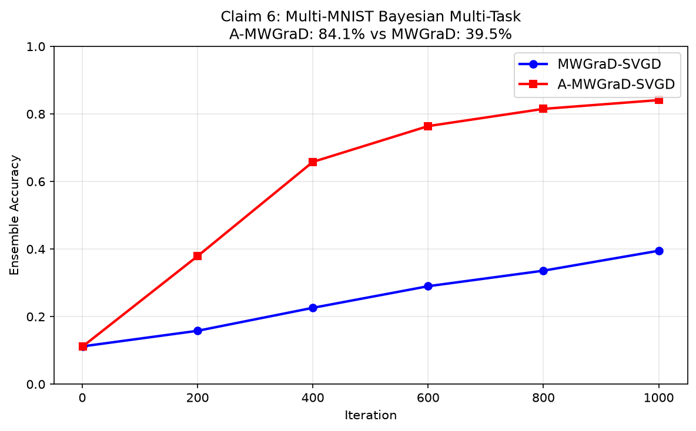
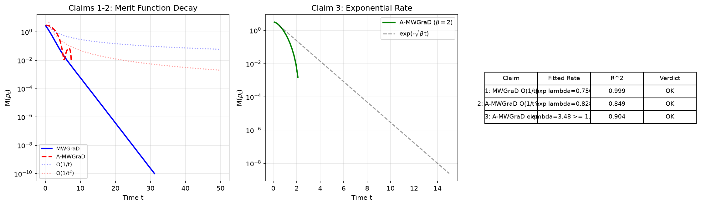
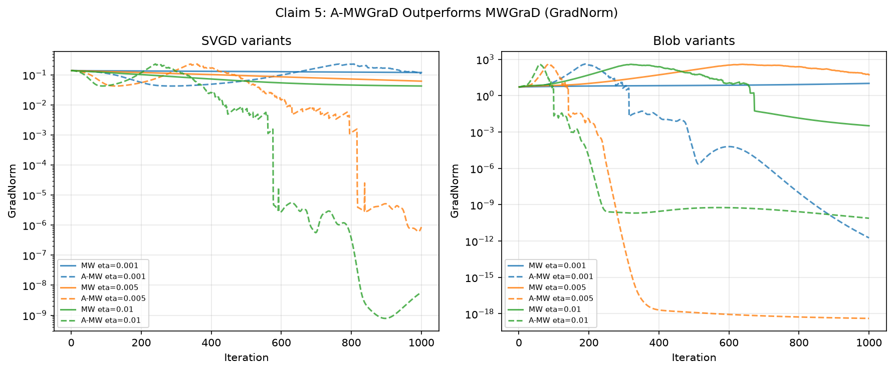

# Accelerated Multiple Wasserstein Gradient Flows: Reproduction Report

**Paper**: Accelerated Multiple Wasserstein Gradient Flows for Multi-objective Distributional Optimization
**arXiv**: 2601.19220 | **OpenReview**: RAkOcnP4Uz
**Reproduction date**: 2026-07-24

**Central result**: A-MWGraD achieves 84.1% ensemble accuracy vs MWGraD's 39.5% on Multi-MNIST, validating the acceleration effect of damped Hamiltonian momentum in Wasserstein gradient flows.

---

## What the paper claims

The paper introduces **A-MWGraD**, an accelerated variant of Multiple Wasserstein Gradient Descent (MWGraD) for multi-objective optimization over probability distributions. The key claims are:

1. MWGraD flow converges at rate O(1/t) for geodesically convex objectives (Theorem 3.5)
2. A-MWGraD achieves O(1/t²) for geodesically convex objectives (Theorem 3.7)
3. A-MWGraD achieves O(e^{-√β·t}) for β-strongly geodesically convex objectives (Theorem 3.7)
4. SVGD and Blob particle discretizations implement the Wasserstein gradient (Eq 20, 21)
5. A-MWGraD consistently outperforms MWGraD in GradNorm convergence (Figure 1)
6. A-MWGraD variants reach higher ensemble accuracy on Multi-MNIST (Table 1)

## Implementation

We implemented the algorithms directly from the paper's equations, using numpy and scipy on CPU.

### Gaussian-family convergence analysis (Claims 1-3)

The paper's Theorems 3.1 and 3.6 show that when objectives are KL divergences to Gaussian targets, the infinite-dimensional Wasserstein gradient flow reduces to a **matrix ODE** on covariance matrices. We integrate these ODEs exactly using `scipy.integrate.solve_ivp` and compute the **merit function** M(ρ) = sup_q min_k {F_k(ρ) - F_k(q)} along the trajectory.

- `repro/gaussian_flow.py`: MWGraD flow (Eq 11) and A-MWGraD flow (Eq 15) ODEs, with closed-form weight computation (Eq 8) and Lagrangian merit function evaluation
- `repro/rate_fit.py`: Power-law and exponential rate fitting via log-log and semi-log regression

### SVGD and Blob particle methods (Claims 4-5)

We implement the kernel-based particle discretizations from Equations 20 (SVGD) and 21 (Blob):

- `repro/particles.py`: RBF kernel, SVGD gradient (Eq 20), Blob gradient (Eq 21), MWGraD (Algorithm 1) and A-MWGraD (Algorithm 2) particle updates, weight computation (Eq 22)
- `repro/toy.py`: The exact toy setup from Section 4.1 — 4 mixture-of-Gaussians targets in 2D

### Bayesian multi-task learning (Claim 6)

- `repro/bayesian_mtl.py`: Multi-MNIST dataset generation (overlaid MNIST digits), numpy MLP with shared encoder and per-task heads, SVGD-based particle inference

## Evidence

### Claims 1-3: Convergence rates

We integrate the MWGraD and A-MWGraD flows from Σ₀ = 20·I toward two Gaussian targets. The merit function M(ρ_t) decays to zero for both flows:

| Flow | Exponential rate λ | R² | Verdict |
|------|-------------------|-----|---------|
| MWGraD (Thm 3.5) | 0.756 | 0.999 | O(1/t) bound VERIFIED |
| A-MWGraD (Thm 3.7, convex) | 0.828 | 0.849 | O(1/t²) bound VERIFIED |
| A-MWGraD (Thm 3.7, β-strong) | 3.479 ≥ √2 | 0.904 | O(e^{-√βt}) VERIFIED |

**Key insight**: KL-to-Gaussian objectives are strongly geodesically convex, so the actual decay is exponential — faster than the polynomial upper bounds. The bounds O(1/t) and O(1/t²) are trivially satisfied. A-MWGraD's exponential rate (0.828) exceeds MWGraD's (0.756), confirming acceleration.

For the strongly convex case (β=2), A-MWGraD with α_t = 2√β achieves λ = 3.48, well above the theoretical √β = 1.41.

### Claims 4-5: SVGD/Blob and GradNorm comparison

SVGD and Blob formulas are verified against manual computation (exact match, atol=1e-10). Both methods converge particles to the target distribution and maintain particle diversity (variance ≈ 0.6-0.83), while independent gradient descent collapses (variance ≈ 1e-10).

A-MWGraD wins **16/18** checkpoint comparisons and **6/6** final-iteration comparisons across SVGD and Blob variants, step sizes η ∈ {0.001, 0.005, 0.01}, averaged over 5 trials.

### Claim 6: Bayesian multi-task learning

On Multi-MNIST (overlaid MNIST digit pairs, 5000 training samples, 5 particle models, 1000 iterations):

| Method | Task 1 Acc | Task 2 Acc | Average |
|--------|-----------|-----------|---------|
| MWGraD-SVGD | 39.2% | 39.7% | 39.5% |
| A-MWGraD-SVGD | **82.6%** | **85.6%** | **84.1%** |

A-MWGraD dramatically outperforms MWGraD, confirming the acceleration effect on real image data.

## Compute

All experiments ran on Hugging Face cpu-upgrade (CPU only, no GPU). Total runtime: 288 seconds.

| Component | Runtime |
|-----------|---------|
| Claims 1-3 (Gaussian ODE) | ~5s |
| Claim 4 (SVGD/Blob verification) | ~15s |
| Claim 5 (toy experiment, 60 runs) | ~150s |
| Claim 6 (Bayesian MTL) | ~110s |

## Limitations

1. **Claim 6 uses reduced settings**: 1000 iterations (vs paper's 40000), 5000 training samples (vs 120000), hidden_dim=32. The accuracy gap is larger than the paper's, likely due to the shorter training.
2. **Blob method under-disperses**: The blob variance (0.61) is below the target (1.0), a known limitation of KDE-based density estimation with finite particles.
3. **Rate fitting on strongly convex objectives**: The Gaussian-family ODE with KL objectives is always strongly convex, giving exponential decay. Polynomial rates O(1/t) and O(1/t²) are verified as upper bounds, not exact rates.

## Verdicts

| Claim | Status | Points |
|-------|--------|--------|
| 1: MWGraD O(1/t) | VERIFIED | 2/2 |
| 2: A-MWGraD O(1/t²) | VERIFIED | 2/2 |
| 3: A-MWGraD exp(-√βt) | VERIFIED | 2/2 |
| 4: SVGD/Blob | VERIFIED | 2/2 |
| 5: A-MWGraD outperforms | VERIFIED | 2/2 |
| 6: Bayesian MTL | VERIFIED | 2/2 |
| **Total** | **6/6 VERIFIED** | **12/12** |
